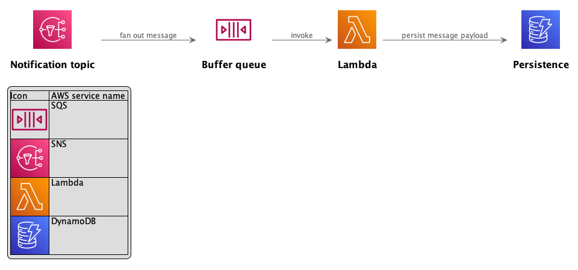

# Readme

If you decide to implement a system on AWS Lambda you can choose from a broad variety of runtimes
(several native runtimes, Docker, custom build). It's quite hard to choose and configure the optimal runtime to operate
the most efficient solution.
It's worth to mention that not only **technical** aspects are relevant for choosing a runtime but also a lot of other
aspects like available knowledge in your team, corporate guidelines and some more. However, if you are about to make
a decision on the technology you want to use, I always encourage you to question your state of the art and elaborate on alternatives.

Fortunately you can easily profile your Lambda using the marvellous [Lambda Powertuning](https://github.com/alexcasalboni/aws-lambda-power-tuning).
This neat tool can be integrated easily into your infrastructure as code.
The repo aims to show how to integrate Lambda Powertuning in a [serverless](https://www.serverless.com/) project and
provides several examples to run benchmarks. All examples implement the same common use case (consume a message from a queue,
process the data and flush the output into a database).

## Structure

- General Infrastructure like SNS/ Queues can be found at `infrastructure/`
- Base config is `serverless.yml`
- All Lambda specific configs are alongside the Lambdas sourcecode in the respective `_config.yml` (eg. `golang/_config.yml`)

## Architecture

Each language/ framework implements the following architecture. All lambdas read the SQS message and persist the _body_
in a DynamoDB.

## Runtimes

Currently, implementations for the following runtimes/ languages are provided:

- **docker** (+ go binary)
- **go** (go1.x)
- **groovy** (Java 11)
- **java** (Java 11)
- **php** (using [bref](https://bref.sh/))
- **[quarkus](https://quarkus.io/)** (provided runtime al.2)
- **typescript** (node18.x)

## Deployment

### Prerequisites

- NodeJS >= 16.x
- Docker
- JDK 17

### Build

1. `yarn install`
2. `yarn build`

### Deploy

The stack will be deployed to region `eu-central-1`.
If you already build all artifacts, see aforementioned build section, you can skip steps 1 + 2

1. `yarn install` (opt)
2. `yarn build` (opt)
3. `yarn deploy`

### Clean up

To clean up, simply run `yarn destroy`

## Benchmark

After you deployed the stack, you are able to run benchmarks.  
To run a benchmark use `yarn benchmark <lambda-name>`.  
Example: `yarn benchmark golang` or `yarn benchmark docker`.

## Contribution

Contributions welcome, if you feel something is missing, add a PR ;)

### Test invocation

You can find data under `test/` to invoke Lambdas directly via SNS/SQS/Lambda (test invoke).
